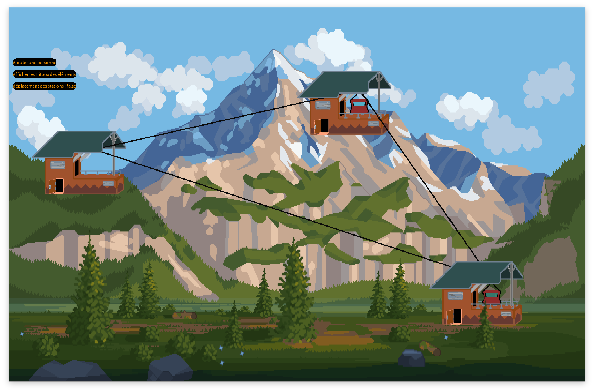
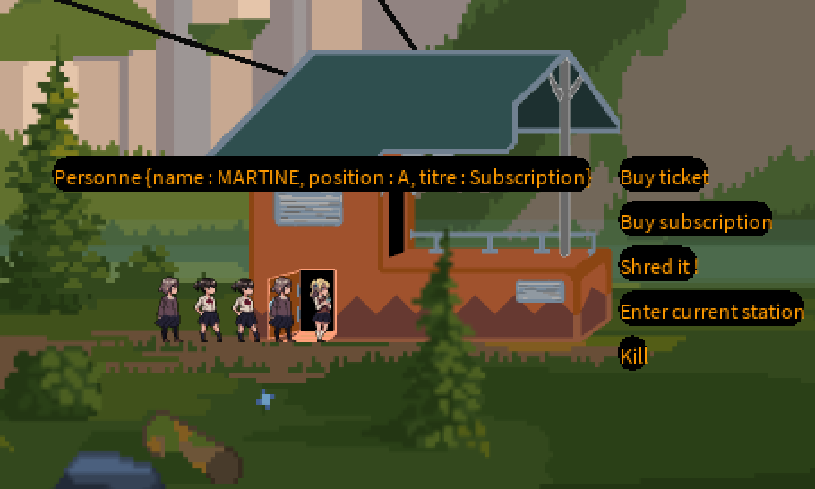
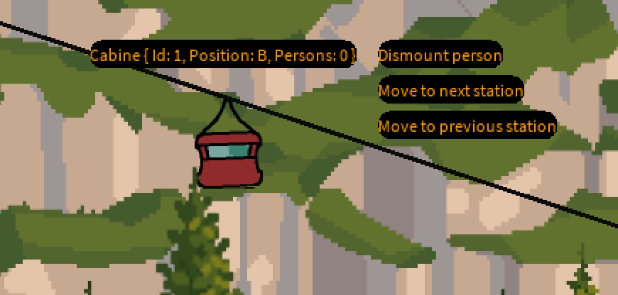
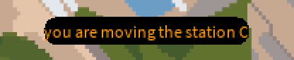

# Projet téléphérique

Ce projet a été réalisé avec processing, dans le but de simuler un téléphérique dans le cadre du cours de projet de programmation destiné au élève en deuxième année de bachelier de science de l'informatique de l'université de Namur.

---

# Développement

## Départ

Le code était au départ fait en event-B, un language de spécification qui permet d'avoir une certaines confiance dans le code si les preuves ont été validées grâce à l'outil Rodin. Dans mon cas les preuves et les spécification étaient respectées ce qui fait que j'ai eu confiance dans le fait que mon programme n'ait pas de problème. J'ai donc pu faire la conversion en processing sans trop de crainte, j'ai voulu passer par l'outil Rodin_to_java, mais à cause de l'utilisation de fonction mathématique j'avais du mal et débuguer le code java. J'ai donc suivit les conseils de mes camarades et j'ai finalement réécrit le code en Java à la main. Etant donné que j'avais déjà le code en event-B la traduction a été faites assez vite.

Pour la programmation en Processing, j'avais en tête quand j'étais plus petit de faire un jeu vidéo, et je me suis dis que c'était le bon moment pour faire quelque chose qui y resemble était donné que nous avions quasiment carte blanche au niveau du design. J'ai regardé un tuto sur youtube pour voir si il était possible de procéder comme dans un jeu vidéo en utilisant des sprites ([vidéo](https://youtu.be/-Z9VUr0IRHo?si=96ewv_KlLbbt7T1n)). Etant donné que cela était possible, je suis parti sur cette approche, j'ai récolté les différentes animation sur le site craftpix.net (voir source).

## Structuration

J'ai découpé mon code en différentes partie étant donné que java est un langage orienté objet j'ai donc pu profiter d'un assez grand niveau abstraction.

Le code est découpé en deux grand morceaux :

- La logique métier
  - les stations
  - les personnes
  - les cabines
  - les titres de transport
- L'affichage
  - initialisation des sprites (image)
  - animation
  - translation
  - boutons

L'affichage doit respecter en permanence la logique métier afin de la représenter au mieux et le plus fidèlement possible. Par facilité, quand un garde est violé, le code renverra une GuardException, ce qui permet d'arrêter le programme. Certaines guarde ne se déclenchait que dans des situations atteignables après plusieurs cliques et ce système m'a permis de m'en rendre rapidement compte de certains oublis. Et m'a éciter les situations ou je ne savais pas pourquoi une certaines action ne se lançait pas durant le développement.

Le code a été découpé comme ceci :

```
.
├── Cabine.pde
├── Direction.java
├── Guard.pde
├── GuardException.java
├── HitBox.pde
├── InitialisationException.java
├── Name.java
├── Personne.pde
├── ProcessingRework.pde
├── README.md
├── Sprite.pde
├── Station.pde
├── Titre_de_transport.java
├── UI.pde
```

La classe Guard renforce certains guard pour qu'ils correspondent à certains évènement, par exemple l'action "faire grimper une personne dans une cabine" nécessitait en rodin de vérifier position cabine =? position personne et personne.titre /= none. Tandis qu'avec l'apparition du déplacement réel de la cabine, ce n'est plus simplement une téléportation mais une translation. Afin de ne pas dénaturer la logique rodin j'ai préféré ajouter la condition cabine.animation /= true plutot que de donner une nouvelle position (par exemple "cable") à la cabine, ce qui me permet en plus de savoir vers où ma cabine se dirige. Pour rendre le code plus clair et cohérent je n'aurais pas du implémenter de guard à l'intérieur des fonctions mais plutot toutes les mettre dans la classe Guard pour une meilleur lisibilité. C'est comme ça que l'outil rodin to java implémente et j'aurais du faire de même, même si la plus part de mes guardes ne font qu'une ligne.

## Règles

1. Tout le monde doit se mettre en file devant la station
2. Une personne ne peut pas dépasser les autres si elle n'a pas de ticket
3. Une personne avec un abonnement est prioritaire sur toutes les autres
4. Une personne peut acheter un ticket ou un abonnement dans la file
5. Une personne ne peut avoir qu'un ticket ou un abonnement ou rien
6. Une personne peut déchirer son abonnement ou son ticket
7. Une personne ne peut rentrer dans une cabine que si l'une d'elle est présente à la station
8. Une personne qui sort de la cabine avec un ticket le perds contrairement au personne avec un abonnement
9. Les personne dans une cabine descende une par une
10. Quand une cabine est a une station, des barrières de sécurité se lèvent
11. Une cabine ne peut pas accueillir plus de quattre personne
12. Une cabine ne peut pas expulser une personne tant qu'elle n'est pas à destination
13. Toutes les cabines doivent être arrivé à leur destination pour recevoir un nouvelle ordre
14. Les cabines peuvent aller de l'avant vers l'arrière et vice versa
15. Les cabines recoivent en même temps les instructions de déplacement
16. L'utilisateur peut ajouter autant de personne qu'il le souhaite
17. Les stations peuvent être déplacées au grés de l'utilisateur à condition que les cabines soient toutes arrétées
18. Les hitbox peuvent être affichées au grés de l'utilisateur

---

# Que peut on y faire ?

## Boutons Stationnaire (toujours cliquable)

- Faire appaître des personnes qui ont pour but se de rendre aux différentes stations via un bouton situé en haut à gauche de l'écran, chaque appuit sur le bouton fera apparaître une personne à chaque station.

- Activer le déplacement des stations, dans le cas où la disposition des stations ne convient pas exactement a vos attentes, une autre manière de régler les problèmes d'affichage peut être abordé dans la section **Changement dans le code**.

- Afficher les hitbox, les zones cliquables des différents éléments dynamique sont mise en évidence. Le contour des zones cliquables est redessiné en vert.

## Elements réactifs (cliquable si la guarde est respectée)

- Les personnes, toutes celles en dehors d'une cabine sont cliquable et ont une apparence différente selon leur titre de transport. Un clique sur une personne affichera ses informations (Position, titre de transport) et les actions suivantes :
  - Acheter un ticket, la personne n'ayant pas de titre de transport se muniera d'un ticket et pourras donc monter dans la cabine après celles possédant un abonnement.

  - Acheter un abonnement, la personne n'ayant pas de titre de transport se muniera d'un abonnement et pourras donc monter dans la cabine avant celles possédant un ticket.

  - Déchirer le ticket ou l'abonnement, la personne possédant un titre de transport ne sera plus munie de sont ticket ou de sont abonnement.

  - Entrer dans la station, la personne se dirigera vers l'entrée de la station en doublant les autres si besoin, afin de monter dans la cabine.

  - Faire disparaitre la personne, la personne disparaitra instantanément dans un nuage de fumée.

- Les cabines, un clique sur une cabine affichera ses informations (Position, Id) et les actions suivantes :
  - Descendre, fait descendre la dernière personne montée dans la cabine, en retirant les tickets aux personnes en possédant, ne fonctionne que si il ya quelqu'un dans la cabine.

  - Station suivante, fait avancer la cabine vers la prochaine station suivant la chaine A->B->C->A->. . . et cela seulement si toutes les cabines sont arrétée a une station

  - Station précédente, fait avancer la cabine vers la prochaine station précédente la chaine C->B->A->C->. . . et cela seulement si toutes les cabines sont arrétée a une station

# Changement dans le code

Conseil : veillez a utiliser `ctrl+F` ou `cmd+F` pour trouver les lignes concernées, la première occurence est celle qui doit vous intérésser.
la variable resize_factor situé au début du code peut être modifiée pour certaines raison, elle permet de changer la taille de tout les éléments visible à l'écran, les valeurs autorisées sont {0.5,1,2,4,8} autrement la stabilité du programme n'est pas assurée. plus le chiffre est grand plus les éléments seront petits
Vous pourriez avoir envie de toucher pour les raisons suivantes :

- La taille de votre écran
- Votre confort visuel
- Volonté de customisation

La ligne `fullscreen();`, il ce peut que vous n'ayez pas envie que l'affichage prenne tout l'écran, de plus sur MacOS il est possible que la partie haute de votre écran masque une partie du programme.
pour désactiver le mode plein écran, il suffit de mettre la ligne en commentaire avec `//` ou bien en supprimant la ligne.

La ligne `size(int width ,int height);` vous permet de choisir une résolution différente pour lancer le programme si la ligne `fullscreen();` a été mise en commentaire sachant que `width` correspond à la largeur de la fenêtre et `height` correspondant à la hauteur de la fenêtre je recommande les résolutions ci dessous :

- `size(1920, 1080);` (écran standard)
- `size(1024, 604);` (écran moyen)
- `size(735, 478);` (petit écran)
- `size(2304, 1296);` (taille original du fond d'écran pour les trèssss grand écran)
- `size(1470, 956);`(résolutions des photos)

le reste du code n'as normalement pas besoin d'être modifié pour satisfaire le confort utilisateur a moins qu'il souhaite ajouter des stations ou des cabines, ce processus est possible sans trop de difficulté mais nécessite de revoir les fonctions `nextStations()`, `previousStation` ainsi que les invariants de classe de Station et Cabine car ils n'acceptent respectivement que les id A,B,C et 1,2.

# Photos

### lancement



### exemple générale


### bulle interactive d'une personne



### bulle interactive d'une cabine


(dans l'image ci dessus, "position : B" signifie que la cabine se dirige vers la station B car elle n'est actuellement pas a une station)

### Pop up de déplacement d'une station



# Sources

Merci à craftpix.net qui m'a permis de reprendre des sprites libre de droit qui m'ont permis d'améliorer l'aspect amusant du programme

- Les personnages : https://craftpix.net/freebies/free-schoolgirls-anime-character-pixel-sprite-pack/
- Le fond d'écran : https://craftpix.net/freebies/free-nature-backgrounds-pixel-art/?num=1&count=72&sq=nature&pos=5

Les stations, les cabines et leurs animations ont cependant été réalisée par mes soins.

# Mes regrets

- Les personnes se déplaçant de la droite vers la gauche marcheront à reculon, c'est due au fait que je ne souhaitait pas doubler les animations chargée en RAM je me suis donc contenté de changer l'ordre des différentes images afin que l'animation reste naturelle car dans la cas contraire l'animation ne semblait pas agréable à la vue des utilisateurs.
- Je ne suis pas un artiste, les différents éléments n'ont donc pas pu tous être réalisé par mes soins
